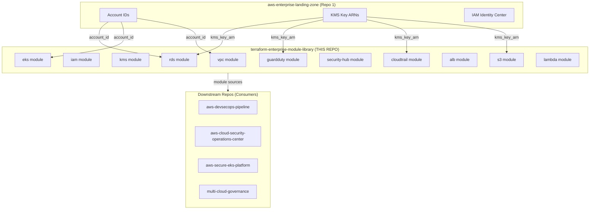
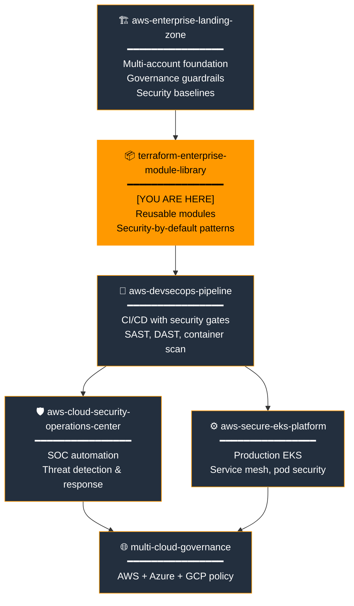
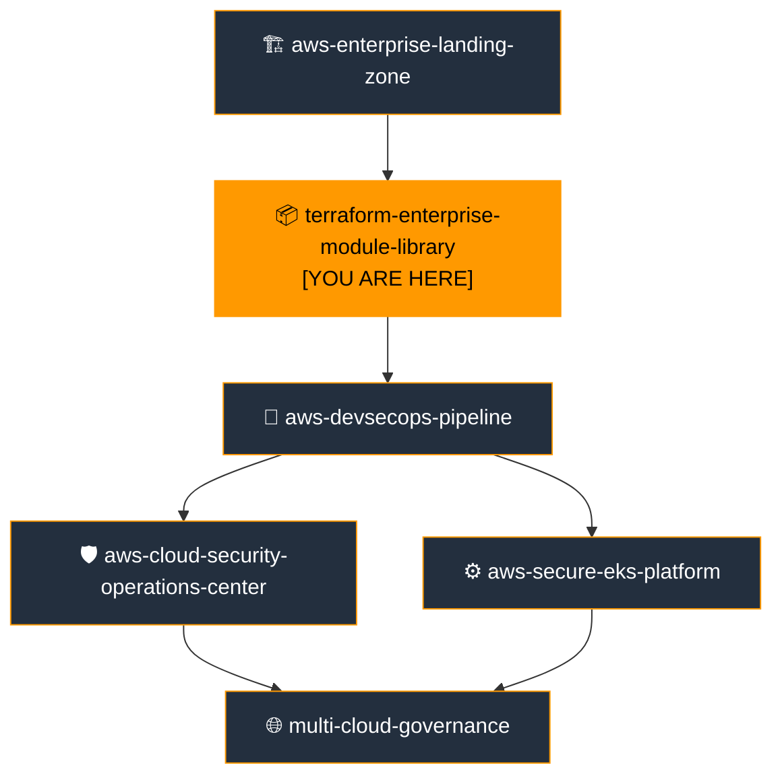

# Terraform Enterprise Module Library

[](https://github.com/e-mulenga/terraform-enterprise-module-library/actions)
[](LICENSE)
[](https://www.terraform.io)
[](https://registry.terraform.io/providers/hashicorp/aws)

> **Portfolio Position 2 of 6** — Enterprise Cloud Platform  
> Reusable, security-hardened Terraform modules consumed by all downstream platform repositories.

---

## Table of Contents

1. [Executive Summary](#1-executive-summary)
2. [Business Problem](#2-business-problem)
3. [Solution Overview](#3-solution-overview)
4. [Architecture Overview](#4-architecture-overview)
5. [Enterprise Cloud Portfolio Position](#5-enterprise-cloud-portfolio-position)
6. [AWS Services Used](#6-aws-services-used)
7. [Service Selection Rationale](#7-service-selection-rationale)
8. [Terraform Structure](#8-terraform-structure)
9. [Deployment Guide](#9-deployment-guide)
10. [Validation Guide](#10-validation-guide)
11. [Security Controls](#11-security-controls)
12. [Monitoring & Observability](#12-monitoring--observability)
13. [Disaster Recovery Strategy](#13-disaster-recovery-strategy)
14. [Cost Optimization Strategy](#14-cost-optimization-strategy)
15. [Operational Runbooks](#15-operational-runbooks)
16. [AWS Well-Architected Review](#16-aws-well-architected-review)
17. [Skills Demonstrated](#17-skills-demonstrated)
18. [Interview Talking Points](#18-interview-talking-points)
19. [Future Enhancements](#19-future-enhancements)
20. [Related Repositories](#20-related-repositories)

---

## 1. Executive Summary

The **Terraform Enterprise Module Library** is a collection of production-grade, security-hardened, reusable Terraform modules that serve as the foundational building blocks for every workload in the Enterprise Cloud Platform Portfolio. Rather than copying configuration between projects, every platform engineer references these modules — ensuring consistent security defaults, naming conventions, encryption, and tagging across hundreds of resources.

This library is **position 2 of 6** in the portfolio — built on the account structure and security baselines established by the [AWS Enterprise Landing Zone](https://github.com/your-org/aws-enterprise-landing-zone-terraform), and consumed directly by the DevSecOps Pipeline, Secure EKS Platform, and Cloud Security Operations Centre.

**11 modules available:**

| Module | Primary AWS Service | Purpose |
|---|---|---|
| `vpc` | Amazon VPC | Multi-AZ network with flow logs, segmented tiers |
| `iam` | AWS IAM | Reusable role factory with permission boundary support |
| `kms` | AWS KMS | Customer-managed keys with rotation and least-privilege policies |
| `s3` | Amazon S3 | Hardened bucket with encryption, TLS, versioning, lifecycle |
| `cloudtrail` | AWS CloudTrail | Account-level audit trail |
| `guardduty` | Amazon GuardDuty | Threat detection with S3/K8s/malware protection |
| `security-hub` | AWS Security Hub | CIS + FSBP compliance aggregation |
| `alb` | AWS ALB | Application load balancer with WAF and access logs |
| `rds` | Amazon RDS | Encrypted, multi-AZ database with automated backups |
| `eks` | Amazon EKS | Secure Kubernetes cluster with managed node groups |
| `lambda` | AWS Lambda | Serverless function with VPC, X-Ray, and reserved concurrency |

---

## 2. Business Problem

### Without a Module Library

| Problem | Impact |
|---|---|
| Every team writes its own VPC Terraform | 5 different VPC designs, 3 with no flow logs, 2 with IMDSv1 |
| Security defaults vary by engineer | One team forgets KMS, another forgets S3 block-public-access |
| Inconsistent tagging | Finance cannot allocate cloud spend by team or project |
| No version control on modules | Breaking changes in shared config cascade silently |
| Knowledge silos | Rotating engineers re-invent solved problems |
| Audit failures | Evidence of encryption and logging not consistently available |

### The Module Library Solves

- **Security by default** — every module enforces encryption, logging, and least privilege. Engineers cannot accidentally skip them.
- **Speed** — a new secure VPC is three lines of Terraform, not 200.
- **Consistency** — Finance, Security, and Ops see the same tagging structure across all workloads.
- **Auditability** — every module version is pinned and tagged, creating a traceable chain from infrastructure to code commit.

---

## 3. Solution Overview

### Design Philosophy

```
Enterprise Rule: "Make the secure path the easy path."
```

Every module implements security controls by default. Disabling them requires an explicit variable override with a documented justification — not an omission.

### Security Defaults in Every Module

| Default | Override possible? | Justification required? |
|---|---|---|
| KMS encryption at rest | Yes (dev only) | Yes |
| S3 block-public-access | No | — |
| TLS-only S3 policy | No | — |
| VPC Flow Logs | No | — |
| CloudWatch Logs retention set | Yes | Yes |
| Versioning enabled | Yes | Yes |

### Module Versioning Strategy

Modules are versioned using Git tags following semantic versioning:

```hcl
# ✅ Correct — pinned version in all non-library repos
module "vpc" {
  source  = "git::https://github.com/your-org/terraform-enterprise-module-library.git//modules/vpc?ref=v2.1.0"
  ...
}

# ❌ Wrong — HEAD reference causes unpredictable changes
module "vpc" {
  source = "git::https://github.com/your-org/terraform-enterprise-module-library.git//modules/vpc"
}
```

---

## 4. Architecture Overview

### Module Composition Pattern



### Provider Composition Pattern

Modules declare no provider configurations. Callers pass providers via composition:

```hcl
# Caller (downstream repo) — passes cross-account provider
provider "aws" {
  alias  = "workload"
  region = var.aws_region
  assume_role { role_arn = "arn:aws:iam::${var.workload_account_id}:role/TerraformRole" }
}

module "vpc" {
  source    = "git::...//modules/vpc?ref=v2.1.0"
  providers = { aws = aws.workload }
  ...
}
```

---

## 5. Enterprise Cloud Portfolio Position



### Portfolio Position Detail

| Attribute | Value |
|---|---|
| **Position** | 2 of 6 — Shared Infrastructure Layer |
| **Type** | Module Library |
| **Deployment order** | After `aws-enterprise-landing-zone` |

**Depends on:** [`aws-enterprise-landing-zone`](https://github.com/your-org/aws-enterprise-landing-zone-terraform)

**Consumes from Landing Zone:**
- Organisation ID (for org-level Config rules)
- KMS key ARNs (CloudTrail, Config, GuardDuty, Backup)
- Account IDs (Security, Logging, Shared Services)

**Produces (consumed by downstream repos):**
- `modules/vpc` → used by `aws-secure-eks-platform`, `aws-devsecops-pipeline`
- `modules/eks` → used by `aws-secure-eks-platform`
- `modules/kms` → used by `aws-cloud-security-operations-center`
- `modules/guardduty` → used by `aws-cloud-security-operations-center`
- `modules/security-hub` → used by `aws-cloud-security-operations-center`, `multi-cloud-governance`
- `modules/rds` → used by `aws-devsecops-pipeline`, `aws-secure-eks-platform`
- `modules/s3` → used by all downstream repos

---

## 6. AWS Services Used

| Module | Core Service | Security Pattern |
|---|---|---|
| `vpc` | Amazon VPC, NAT Gateway, Flow Logs | Network segmentation, all-traffic flow logging |
| `iam` | AWS IAM | Permission boundaries, least-privilege inline policies |
| `kms` | AWS KMS | CMKs per service, annual key rotation |
| `s3` | Amazon S3 | Block-public-access, TLS-only policy, KMS encryption |
| `cloudtrail` | AWS CloudTrail | Log file validation, KMS encryption, CloudWatch delivery |
| `guardduty` | Amazon GuardDuty | S3 + K8s + malware data sources, SNS alerting |
| `security-hub` | AWS Security Hub | CIS v1.4 + FSBP standards, EventBridge routing |
| `alb` | AWS ALB, WAF v2 | TLS termination, WAF rules, access logging to S3 |
| `rds` | Amazon RDS, Secrets Manager | Multi-AZ, encrypted, automated backups, no public access |
| `eks` | Amazon EKS, EC2 | Private cluster, managed node groups, envelope encryption |
| `lambda` | AWS Lambda, X-Ray | VPC deployment, X-Ray tracing, reserved concurrency |

---

## 7. Service Selection Rationale

### Why Reusable Modules?

**Problem:** Without modules, every team writing VPC Terraform independently produces divergent, inconsistent infrastructure. Teams copy-paste from Stack Overflow — often omitting security controls like flow logs, KMS encryption, or public access blocks.

**Solution:** Modules encapsulate the secure, enterprise-approved pattern once. Consumers get the right thing by default — they only provide the variable values, not the security logic.

**Alternatives considered:**
- **AWS Service Catalog** — Terraform-based products in Service Catalog provide governance but require console-based consumption and lack version pinning flexibility.
- **Terraform Cloud private registry** — viable for very large organisations; adds cost and operational overhead. Git-based sourcing is sufficient for portfolio scale.
- **CDK Constructs (L3)** — excellent for TypeScript/Python teams; doesn't fit a Terraform-standardised portfolio.

**Why this was preferred:** Git-sourced modules with `?ref=` pinning provide version governance, are free, work with all Terraform workflows, and integrate directly with the existing GitHub Actions CI/CD.

---

### Why Environment Separation (dev/test/prod)?

**Problem:** A single set of examples makes it tempting to use the same configuration in every environment, resulting in over-provisioned dev (wasted spend) or under-provisioned prod (reliability risk).

**Solution:** Environment-specific examples allow:
- Dev: `single_nat_gateway = true` (saves ~$100/month per NAT Gateway)
- Dev: 30-day log retention vs 365-day in prod
- Dev: 2 AZs vs 3 in prod
- Prod: `deletion_protection = true` on RDS
- Prod: `multi_az = true` on RDS

**No values are hardcoded** — all environment differences live in `terraform.tfvars` files.

---

### Why `provider.tf` (not `versions.tf`)?

**Portfolio standard:** A single `provider.tf` file contains both the `terraform {}` block (version constraints and required providers) and the `provider` configurations. This eliminates the confusion of two files that define related but split Terraform runtime concerns.

```hcl
# provider.tf — one file, complete Terraform configuration context
terraform {
  required_version = ">= 1.6.0"
  required_providers { aws = { source = "hashicorp/aws", version = "~> 5.40" } }
  backend "s3" {}
}

provider "aws" { region = var.aws_region }
```

---

### Why `terraform.tfvars.example`?

**Problem:** Committing real `terraform.tfvars` files exposes account IDs, emails, KMS ARNs, and potentially secrets to git history.

**Solution:** `terraform.tfvars.example` is committed — it shows every variable that must be set, with placeholder values. The real `terraform.tfvars` is excluded by `.gitignore`. Engineers run:

```bash
cp terraform.tfvars.example terraform.tfvars
# Fill in real values
# Never commit terraform.tfvars
```

CI/CD pipelines populate values from GitHub Secrets / AWS Secrets Manager at run time.

---

## 8. Terraform Structure

```
terraform-enterprise-module-library/
├── provider.tf                          # terraform{} block + AWS provider (NO versions.tf)
├── variables.tf                         # Root variables for running examples
├── outputs.tf                           # Landing zone remote state reader + module outputs
├── terraform.tfvars.example             # Template (NEVER commit terraform.tfvars)
├── .gitignore
│
├── modules/
│   ├── vpc/                             # Multi-AZ VPC with flow logs and tiered subnets
│   │   ├── main.tf
│   │   ├── variables.tf
│   │   └── outputs.tf
│   ├── iam/                             # Role factory with permission boundary support
│   ├── kms/                             # CMKs with per-service least-privilege key policies
│   ├── s3/                              # Hardened bucket (TLS-only, block-public, KMS, lifecycle)
│   ├── cloudtrail/                      # Account-level trail with CloudWatch delivery
│   ├── guardduty/                       # Detector with S3/K8s/malware, SNS alerting
│   ├── security-hub/                    # CIS v1.4 + FSBP + NIST standards
│   ├── alb/                             # ALB with WAF v2 and S3 access logging
│   ├── rds/                             # Multi-AZ RDS with encryption and Secrets Manager
│   ├── eks/                             # Secure EKS cluster with managed node groups
│   └── lambda/                          # Lambda with VPC, X-Ray, and concurrency controls
│
├── examples/
│   ├── dev/                             # Dev composition: single NAT, 2 AZs, 30-day logs
│   │   ├── main.tf
│   │   ├── backend.tf
│   │   └── terraform.tfvars.example
│   ├── test/
│   │   ├── main.tf
│   │   ├── backend.tf
│   │   └── terraform.tfvars.example
│   └── prod/                            # Prod composition: 3 AZs, HA NAT, 365-day logs
│       ├── main.tf
│       ├── backend.tf
│       └── terraform.tfvars.example
│
├── .github/workflows/
│   ├── module-test.yml                  # Terratest + tfsec on every PR
│   └── release.yml                      # Semantic version tagging on merge to main
│
├── architecture/
│   └── service-selection-rationale.md
├── validation/
│   └── validate-modules.sh
├── scripts/
│   └── bootstrap-state.sh
└── README.md
```

### Module Design Standards

Every module follows these invariants:

1. **`main.tf`** — resource declarations only, no provider blocks
2. **`variables.tf`** — all inputs with `type`, `description`, and `default` (or explicit no-default for required)
3. **`outputs.tf`** — all outputs with `description`; sensitive values marked `sensitive = true`
4. **No hardcoded values** — region, account ID, environment, org name all come from variables
5. **`for_each` over `count`** — named resource management is stable on rename
6. **Tag inheritance** — modules use the caller's `default_tags`; module-specific tags merged locally
7. **Security defaults on** — encryption, logging, and access controls active without opt-in

---

## 9. Deployment Guide

### Consuming a Module from a Downstream Repo

```hcl
# In aws-secure-eks-platform or any downstream repo

module "vpc" {
  # Pin to a specific version tag — never use HEAD
  source = "git::https://github.com/your-org/terraform-enterprise-module-library.git//modules/vpc?ref=v2.1.0"

  organization_name      = var.organization_name
  environment            = var.environment
  vpc_cidr               = "10.20.0.0/16"
  az_count               = 3
  single_nat_gateway     = false    # HA — one NAT per AZ
  kms_key_arn            = data.terraform_remote_state.landing_zone.outputs.kms_cloudtrail_key_arn
}

module "app_bucket" {
  source = "git::https://github.com/your-org/terraform-enterprise-module-library.git//modules/s3?ref=v2.1.0"

  bucket_name  = "${var.organization_name}-${var.environment}-app"
  kms_key_arn  = data.terraform_remote_state.landing_zone.outputs.kms_cloudtrail_key_arn
  lifecycle_rules = [{
    id = "ia-after-30"
    transitions = [{ days = 30, storage_class = "STANDARD_IA" }]
  }]
}
```

### Running the Examples Directly

```bash
# 1. Bootstrap state (if not done by landing-zone)
ENV=dev ORG=acme AWS_REGION=af-south-1 bash scripts/bootstrap-state.sh

# 2. Initialise
cd examples/dev
terraform init -backend-config=backend.tf -reconfigure

# 3. Configure
cp terraform.tfvars.example terraform.tfvars
# Edit terraform.tfvars

# 4. Plan and apply
terraform plan -var-file=terraform.tfvars
terraform apply -var-file=terraform.tfvars
```

### Module Release Workflow

```bash
# After merging to main, create a version tag
git tag -a v2.1.0 -m "feat(vpc): add IPv6 dual-stack support"
git push origin v2.1.0

# All downstream repos then update their ?ref= pin in a PR
# Automated via GitHub Actions release.yml
```

---

## 10. Validation Guide

```bash
# Validate all modules
bash validation/validate-modules.sh

# Format check
terraform fmt -check -recursive

# Validate (no backend)
for MODULE in modules/*/; do
  echo "Validating ${MODULE}..."
  cd "${MODULE}"
  terraform init -backend=false -input=false
  terraform validate
  cd -
done

# Security scan all modules
tfsec modules/ --minimum-severity HIGH
checkov -d modules/ --framework terraform
```

---

## 11. Security Controls

### Per-Module Security Defaults

| Module | Encryption | Logging | Network Isolation | Access Control |
|---|---|---|---|---|
| `vpc` | KMS (flow logs) | VPC Flow Logs (ALL traffic) | Tiered subnets, deny-all default SG | N/A |
| `iam` | N/A | CloudTrail (API calls) | N/A | Permission boundary support |
| `kms` | Self-encrypting | CloudTrail key usage | N/A | Least-privilege key policies |
| `s3` | KMS CMK | S3 access logging | Block-public-access | TLS-only bucket policy |
| `rds` | KMS CMK | Enhanced monitoring | No public access, intra subnet | Secrets Manager credentials |
| `eks` | KMS envelope | CloudTrail, audit logs | Private endpoint, no public API | RBAC, node IAM scoped |
| `lambda` | KMS (env vars) | CloudWatch Logs, X-Ray | VPC deployment | Least-privilege execution role |
| `alb` | TLS termination | S3 access logs | Security group | WAF v2 rules |

### Terraform Security Controls

| Control | Implementation |
|---|---|
| No secrets in tfvars | All secrets reference AWS Secrets Manager ARNs or SSM params |
| No hardcoded account IDs | Account IDs consumed from landing zone remote state |
| Encrypted remote state | S3 backend with KMS + DynamoDB lock |
| OIDC CI/CD | No long-lived AWS keys in GitHub |
| Module pinning | `?ref=vX.Y.Z` enforced by `release.yml` PR check |
| PR security gate | tfsec + checkov + gitleaks on every PR |

---

## 12. Monitoring & Observability

Each module provisions its own observability resources:

- **`vpc`** — CloudWatch Log Group for VPC Flow Logs; all-traffic capture
- **`eks`** — CloudWatch Container Insights, control plane logs (api, audit, authenticator)
- **`rds`** — Enhanced Monitoring (60-second granularity), Performance Insights
- **`lambda`** — CloudWatch Logs, X-Ray tracing, custom metric namespace
- **`alb`** — Access logs to S3, CloudWatch request count and latency metrics

Modules expose CloudWatch Log Group names and metric namespaces as outputs, enabling the downstream `aws-cloud-security-operations-center` to subscribe and aggregate.

---

## 13. Disaster Recovery Strategy

Module-level DR considerations:

- **`vpc`** — Identical module calls in primary and DR regions with different `vpc_cidr` ranges prevent overlap during VPC peering or Transit Gateway attachment.
- **`rds`** — `multi_az = true` in prod; read replicas can be promoted in minutes.
- **`s3`** — S3 Cross-Region Replication configured as a variable option.
- **`eks`** — Module supports separate control plane in DR region; stateless workloads re-deploy from the same module call.
- **`kms`** — Module creates multi-region replica keys when `multi_region = true`.

All modules support idempotent re-apply — re-running `terraform apply` on a clean DR account recreates the entire stack from state-free code.

---

## 14. Cost Optimization Strategy

### Environment Cost Profiles

| Module | Dev saving | Mechanism |
|---|---|---|
| `vpc` | ~$100/month | `single_nat_gateway = true` — 1 NAT vs 3 |
| `rds` | ~$200/month | `multi_az = false`, smaller instance class |
| `eks` | ~$150/month | 1 node group, smaller instance types |
| `cloudtrail` | ~$5/month | Reduced data event recording |
| `s3` | ~$10/month | 30-day retention vs 365 |

### Tagging for Cost Allocation

Every module inherits `default_tags` from the provider:

```hcl
default_tags {
  tags = {
    Environment = var.environment
    CostCenter  = var.cost_center
    Owner       = var.owner
    ManagedBy   = "Terraform"
    Repository  = "terraform-enterprise-module-library"
    Portfolio   = "enterprise-cloud-platform"
  }
}
```

AWS Cost Explorer + tag-based cost allocation enables per-team, per-environment spend reporting.

---

## 15. Operational Runbooks

### Adding a New Module

1. Create `modules/<name>/{main.tf,variables.tf,outputs.tf}`
2. Follow the module design standards (section 8)
3. Add an example in `examples/dev/main.tf`
4. Add a tfsec + checkov baseline scan result to `validation/`
5. Update this README — Terraform Structure and AWS Services Used sections
6. Open PR, get 2 approvals, merge
7. Tag a new minor version: `git tag -a v2.2.0 -m "feat(<name>): add <name> module"`

### Updating a Module (Breaking Change)

1. Create a feature branch: `git checkout -b feat/<module>-v3`
2. Increment the major version in the PR title
3. Update all `examples/` references to use the new version
4. Add migration notes to `CHANGELOG.md`
5. Downstream repos must update their `?ref=` pin in a separate PR

---

## 16. AWS Well-Architected Review

### Operational Excellence

- Modules are documented, versioned, and tested — eliminating tribal knowledge
- `terraform fmt` and `tfsec` enforced in CI — code quality is automated
- Semantic versioning enables controlled upgrades across all consumers

### Security

- Security defaults require opt-out, not opt-in
- No secrets in code — Secrets Manager and SSM Parameter Store references
- KMS encryption on every data store by default
- VPC isolation with denied-by-default security group

### Reliability

- Multi-AZ patterns built into `vpc`, `rds`, `eks` modules
- Module idempotency allows re-apply after failure
- `prevent_destroy` lifecycle on critical resources (RDS, EKS cluster)

### Performance Efficiency

- Right-sized defaults per environment via environment-specific examples
- EKS managed node groups with auto-scaling enabled by default
- RDS Performance Insights enabled in prod

### Cost Optimization

- Environment-specific variable defaults (single NAT in dev)
- All resources tagged for Cost Explorer allocation
- Reserved capacity guidance documented in module READMEs

### Sustainability

- Serverless Lambda module reduces idle compute
- Single-region S3 replication only for objects requiring DR
- EKS Spot instance support built into node group module

---

## 17. Skills Demonstrated

- **Terraform module design** — factory patterns, variable validation, output contracts
- **AWS network architecture** — VPC tier design, NAT HA, flow log analysis
- **Security engineering** — KMS key policy design, S3 hardening, IAM permission boundaries
- **Platform engineering** — DRY infrastructure, module versioning, cross-repo consumption
- **Cost engineering** — environment-differentiated resource sizing, tagging strategy
- **DevSecOps** — module CI/CD with security gates, semantic versioning, CHANGELOG discipline
- **Documentation** — architecture decisions, operational runbooks, consumer guides

---

## 18. Interview Talking Points

### "Why build a module library instead of using the Terraform public registry?"

> "Public registry modules are great starting points but rarely meet enterprise security standards out of the box. They may not enforce KMS encryption, may expose public IPs by default, or may not follow your organisation's naming convention. Building an internal library means every module is reviewed by our security team, tested against our CIS baseline, and follows our variable naming convention — so downstream teams can consume them without re-reviewing security. We also retain control over upgrade timing: we pin downstream consumers to specific git tags and test the upgrade path before rolling out to prod."

### "How do you prevent configuration drift between environments?"

> "The same module code runs in dev, test, and prod — the only difference is the variable values in `terraform.tfvars`. Dev uses `single_nat_gateway = true` for cost; prod uses three. Dev has 30-day log retention; prod has 365 days. The security defaults — encryption, TLS policy, block-public-access — are identical and not configurable away. So there's structural parity between environments: if it works in test, the same code works in prod. Terraform's `-detailed-exitcode` in the CI drift-detection job flags any manual change within 24 hours."

### "How do you handle secrets in Terraform?"

> "We never put secrets in Terraform variable values or tfvars files. Database passwords and API keys are stored in AWS Secrets Manager, provisioned outside Terraform or by a separate Secrets Manager Terraform module that outputs only the ARN. The consuming resource — RDS, Lambda — references the secret ARN, not the value. In CI/CD, OIDC provides AWS credentials so no AWS access key ever touches the GitHub runner's environment variables."

---

## 19. Future Enhancements

| Enhancement | Module | Priority |
|---|---|---|
| AWS Transfer Family module | New | Medium |
| ElastiCache Redis module (encrypted) | New | Medium |
| Step Functions module with X-Ray | New | Low |
| Terraform test framework (native) | All | High |
| OPA policy enforcement on module variables | All | High |
| Module auto-upgrade PR via Renovate | CI/CD | Medium |
| ECS Fargate module | New | Medium |
| WAF managed rule groups module | New | Medium |
| SNS + SQS module with CMK | New | Low |

---

## 20. Related Repositories

### Enterprise Cloud Platform Portfolio



| Repository | Relationship | My Modules Used |
|---|---|---|
| **[aws-enterprise-landing-zone](https://github.com/your-org/aws-enterprise-landing-zone-terraform)** | **Upstream — provides account IDs, KMS ARNs** | Provides KMS, S3, CloudTrail baseline |
| **[terraform-enterprise-module-library](https://github.com/your-org/terraform-enterprise-module-library)** | **YOU ARE HERE** | All 11 modules |
| **[aws-devsecops-pipeline](https://github.com/your-org/aws-devsecops-pipeline)** | **Downstream — consumes vpc, iam, s3, rds** | vpc, iam, s3, rds, lambda |
| **[aws-cloud-security-operations-center](https://github.com/your-org/aws-cloud-security-operations-center)** | **Downstream — consumes kms, guardduty, security-hub** | kms, guardduty, security-hub, s3 |
| **[aws-secure-eks-platform](https://github.com/your-org/aws-secure-eks-platform)** | **Downstream — consumes vpc, eks, rds, alb** | vpc, eks, rds, alb, iam, kms, s3 |
| **[multi-cloud-governance](https://github.com/your-org/multi-cloud-governance)** | **Downstream — aggregates posture** | security-hub, cloudtrail |

---

## Author

**Emmanuel Mulenga** — Multi-Cloud Engineer
- 🌐 [](https://www.linkedin.com/in/emmanuel-mulenga)
- 💻 [](https://github.com/e-mulenga)

---

*Terraform Enterprise Module Library — Enterprise Cloud Platform Portfolio | Position 2 of 6*
